# 1. Ubuntu Linux Installation

First we'll get a basic Ubuntu Linux Installation up and running.

## Prerequisites

1. Download the latest [Ubuntu Desktop 64-bit ISO](https://launchpad.net/ubuntu/+cdmirrors) (e.g. `ubuntu-16.10-desktop-amd64.iso`) from your local Ubuntu mirror (so as to preserve your quota and to download it as fast as possible). We're using _Ubuntu Linux_ as it is (or at least it was) the primary Linux distribution being used by the .NET Core team.

2. Download the latest [VirtualBox installer](https://www.virtualbox.org/wiki/Downloads) for your operating system of choice e.g. Windows `VirtualBox-5.1.10-112026-Win.exe` or macOS `VirtualBox-5.1.10-112026-OSX.dmg`. Also download the corresponding version of the [extension pack](https://www.virtualbox.org/wiki/Downloads) e.g. for all operating systems `Oracle_VM_VirtualBox_Extension_Pack-5.1.10-112026.vbox-extpack`. This extension pack contains host drivers for USB etc.

## Installing and configuring VirtualBox

1. Install VirtualBox by following the prompts. You should include __all__ options.

2. Double-click the VirtualBox Extension Pack and click __accept__ to install.

3. VirtualBox should now be open.

4. Update the "host key combination" in VirtualBox Preferences as follows:

  a. (macOS) __Preferences... => Input => Virtual Machine__ and update the __Host Key Combination__ to _Right COMMAND_.

  b. (Windows) __File => Preferences... => Input => Virtual Machine__ and update the __Host Key Combination__ to _Right CTRL_.

  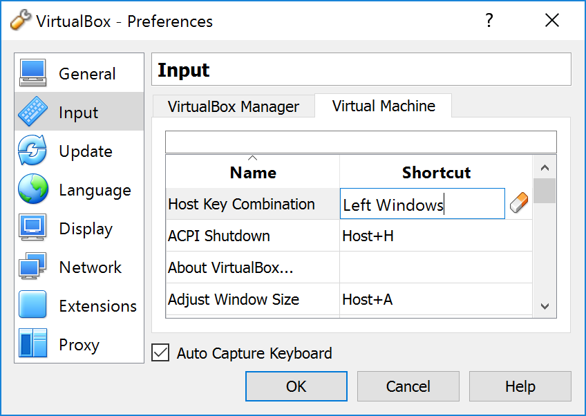

## Creating the new VM

1. Click __New__ in VirtualBox to begin the process of creating your new VM.

2. Give your VM a __name__ (e.g. Ubuntu), select __type__ _Linux_, __version__ _Ubuntu (64-bit)_ and then click __next__.

  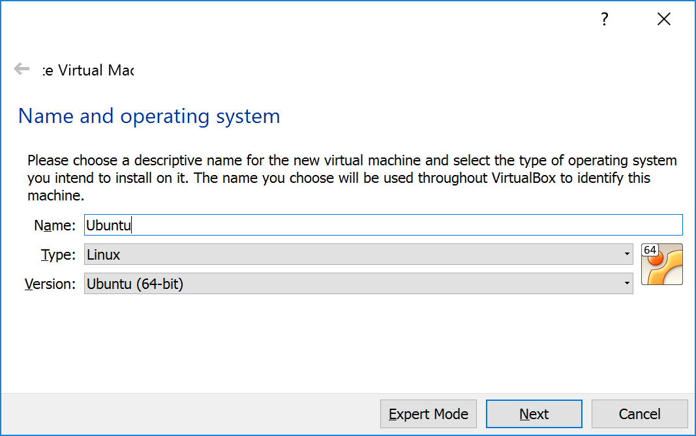

3. Determine how much memory (RAM) to dedicate to your VM. I recommend a minimum of `2048MiB` and a maximum of `50%` of your host's physical memory e.g. in my case I have a MacBook Pro with `16GiB` of memory so I chose to configure my new VM with `4096MiB` of memory. Then click __next__.

  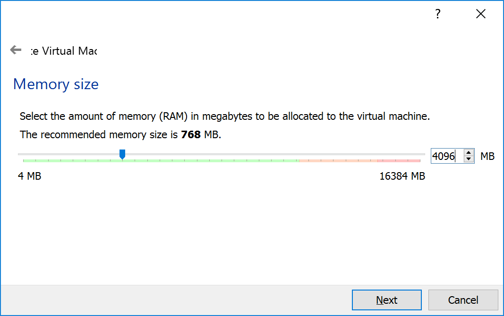

4. Leave the option _Create a virtual hard disk now_ in place and click __create__.

  

5. Leave the option _VDI (VirtualBox Disk Image)_ in place and click __next__.

  

6. Leave the option _Dynamically allocated_ in place and click __next__.

  

7. Determine the maximum size for your __dynamically allocated disk__. I recommend setting this to a reasonable size which is less than the currently available space on the host disk e.g. in my case I have `182GiB` free so I __set the maximum disk size to `128GB`__. The other option is to set it to `2TB` and monitor actual `.vdi` file size yourself. This maximum size can be altered later via the command line tools so it's not _set in stone_.

8. Once you are happy with all your settings click __create__ to build your new VM and VHDD.

__Note: Make sure you have set the maximum disk size to at least 128GB before continuing! 8GiB will not be enough once you start playing with Docker containers.__

  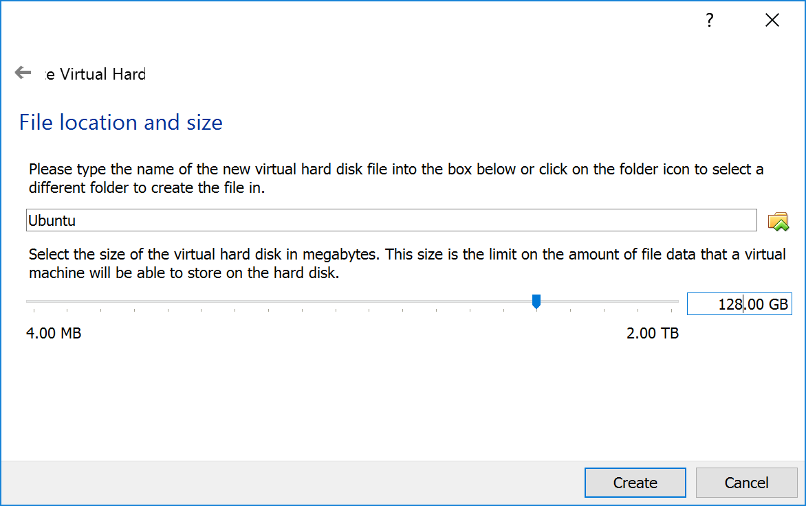

## Configuring your new VM

You now have a new __powered off__ VM so we want to update the configuration using some "more-optimal" defaults prior to installing Linux. These "more-optimal" settings are based on my experiences for what makes for a fast, enjoyable VM. If you run into any issues with your VM go back to the defaults.

Click __settings__ to configure your new VM.

#### General => Advanced

1. Set __shared clipboard__ and __drag'n'drop__ to _bidirectional_.

  

#### System => Motherboard

1. Set __boot order__ to a) _floppy_ b) _network_ c) _optical_ d) _hard disk_ **and then disable _floppy_ and _network_**.

2. Set __chipset__ to _ICH9_.

3. Set __pointing device__ to a setting which matches your host hardware e.g. I'm on a `2015 MacBook Pro` so I set it to _USB multi-touch tablet_ when in macOS. When in Windows I set it to _PS/2 Mouse_ (as I'm using just a mouse).

4. If the _only_ host operating system you run on your PC is Windows __unselect__ _Hardware Clock in UTC Time_.

  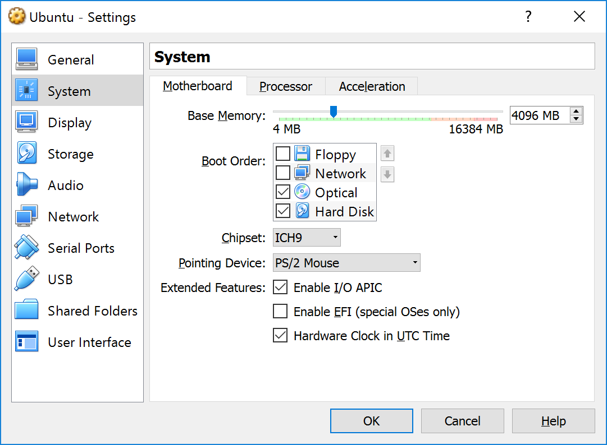

  __Note:__ Windows generally expects its hardware clock in to be in _local time_. macOS (and most other operating systems) run their hardware clock in _UTC by default_. Windows can be told it's hardware clock is in UTC using via the registry as described [here](http://superuser.com/a/975764/120578).

#### System => Processor

1. Determine how many __Processor(s)__ to assign to your new VM. I recommend a minimum of `1` and a maximum of `half the number` of __logical__ CPU cores of your host machine e.g. in my case I have a `2015 MacBook Pro` with `4 physical / 8 logical` CPU cores, so I _could_ set the virtual CPU cores to `4`, however I just select `1` as that's all I will need for Linux.

2. Check __enable PAE/NX__.

  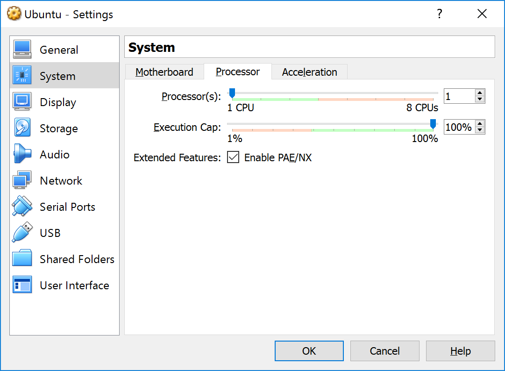

#### System => Acceleration

1. Set __paravirtualization interface__ to _KVM_ which is the [recommended setting](http://superuser.com/questions/945910/how-to-select-paravirtualization-interface-in-virtual-box) for Linux guests. When using a Windows guest you should set it to _Hyper-V_. Today we are using a Linux guest (VM) so select _KVM_.

  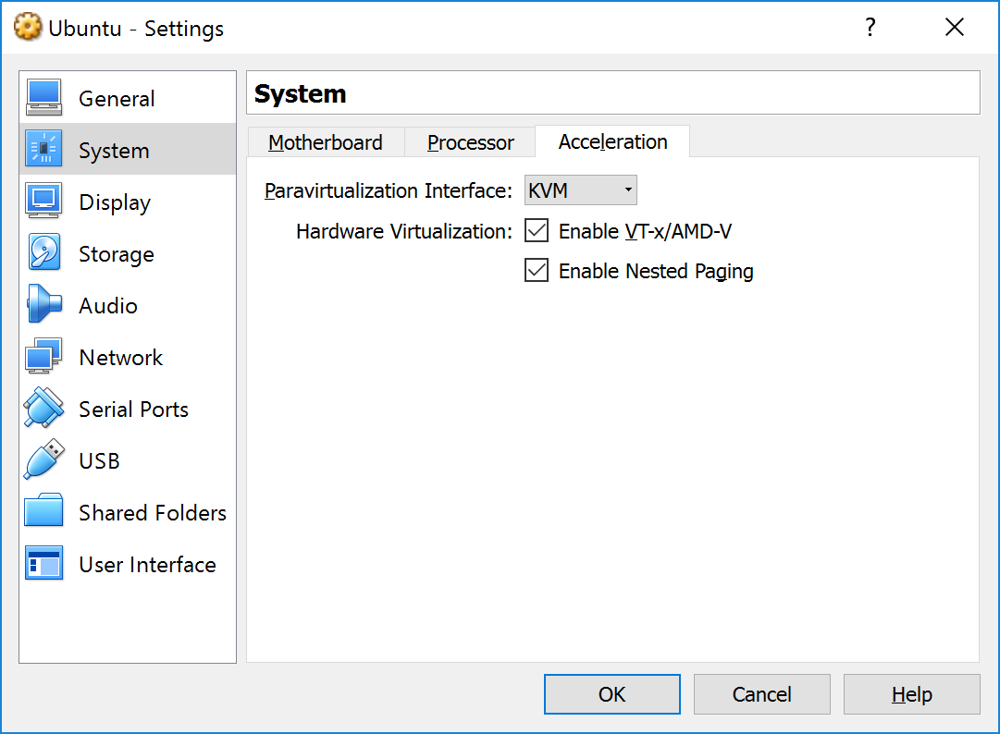

  > VirtualBox allows exposing a paravirtualization interface to facilitate accurate and efficient execution of software within a virtual machine. These interfaces require the guest operating system to recognize their presence and make use of them in order to leverage the benefits of communicating with the VirtualBox hypervisor.

  > Most mainstream, modern guest operating systems, including Windows and Linux, ship with support for one or more paravirtualization interfaces. Hence, there is typically no need to install additional software in the guest (including VirtualBox Guest Additions) to make use of this feature.

  > Exposing a [paravirtualization provider](https://www.virtualbox.org/manual/ch10.html#gimproviders) to the guest operating system does not rely on the choice of host platforms. For example, the Hyper-V paravirtualization provider can be used for VMs to run on any host platform (supported by VirtualBox) and not just Windows.

  __Note:__ The option __default__ _should_ have the same effect i.e. _default_ will automatically set the optimal __paravirtualization interface__ setting dependent on the guest operating system selected.

#### Display => Screen

1. Increase the __video memory__ to the maximum available setting. In my case this is `128MB`.

2. Check __enable 3D acceleration__.

3. If you are on a "retina" (High-PPI display) you should set you __scale factor__ to `200%`.

  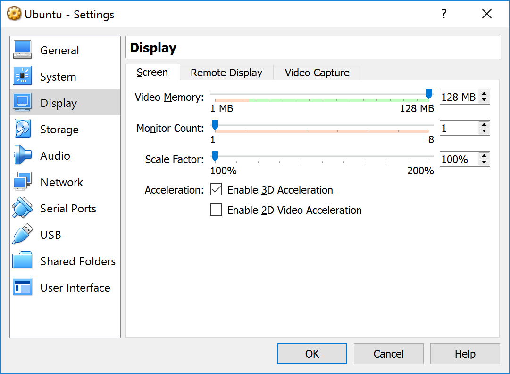

#### Storage

1. Remove the __empty__ virtual optical drive from the __storage tree__ by selecting it and then clicking the _subtract disk_ icon at the bottom (second from the left).

2. Remove the virtual __controller: ide__ from the __storage tree__ by selecting it and then clicking the _subtract controller_ icon at the bottom (the rightmost icon).

3. Add a new virtual optical drive by selecting __controller: sata__ and clicking the _add disk_ icon at the bottom (the leftmost icon). When the modal appears click __choose disk__ and select the Ubuntu Linux `.iso` file e.g. `ubuntu-16.10-desktop-amd64.iso` downloaded earlier. Also check __use host i/o cache__.

4. If your host has an SSD select __Ubuntu.vdi__ and check __solid-state drive__.

  

__Note:__ This screen is where the most errors get made. Double check your configuration against the screenshot above.

#### Audio

1. Set __audio controller__ to _Intel HD Audio_.

  

#### Network => Adapter 1

1. Expand the __advanced__ section and set the __adapter type__ to _paravirtualized network (virtio-net)_.

  > [Virtio](http://wiki.libvirt.org/page/Virtio) is a virtualization standard for network and disk device drivers where just the guest's device driver "knows" it is running in a virtual environment, and cooperates with the hypervisor. This enables guests to get high performance network and disk operations, and gives most of the performance benefits of paravirtualization.

2. If you are on "wired network" (e.g. ethernet) set __attached to__ to _bridged adapter_. If you're on a "wireless network" (e.g. `802.11abgn` or `4G` etc) leave __attached to__ as _NAT_ as a lot of wireless access points will not allow multiple DCHP allocations to the same physical device (so the virtual device will fail to get an IP address).

  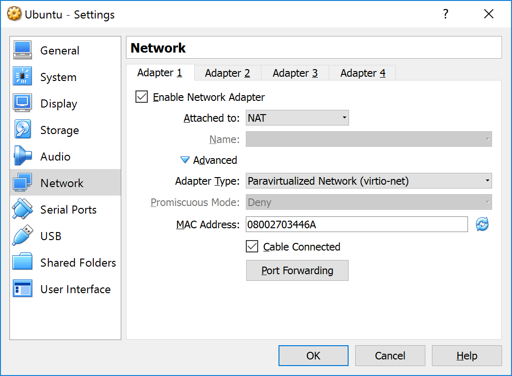

#### Ports => USB

1. Select __USB 3.0 (xHCI) Controller__.

  

__Done!__ Click __OK__ to save the VM settings.

## Booting your new VM and installing Linux

1. Double-click your new VM labelled __Ubuntu => Powered Off__ to boot the VM and begin the installation.

  

  __Note:__ While your new VM is booting into the installation screen, if your are using a host with a "retina" screen make sure you have selected __View => Scale Factor => 200%__ so you can actually see your VM while it's installing.

2. Once you arrive at the first screen labelled __Install__ click _Install Ubuntu_.

  

3. Check _download updates while installing Ubuntu_. If you want to be able to play _patent-encumbered audio formats_ et al you should also check _install this third-party software..._. Once you're happy click _continue_.

  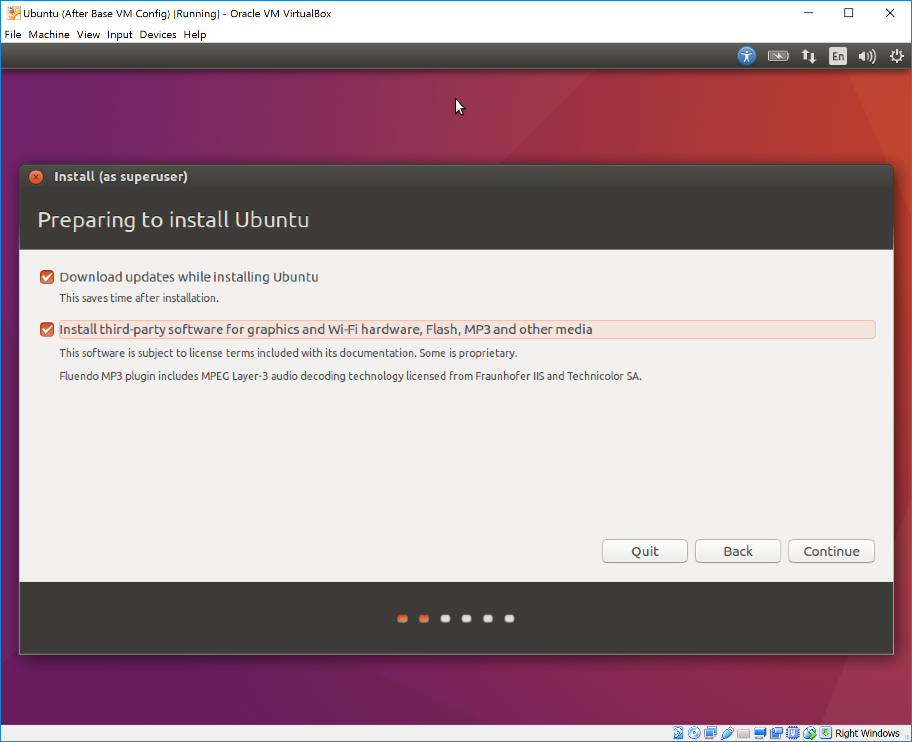

4. To keep things simple leave the default option __Erase disk and install Ubuntu__ in place, select __Use LVM with the new Ubuntu installation__ and click _install now_.

  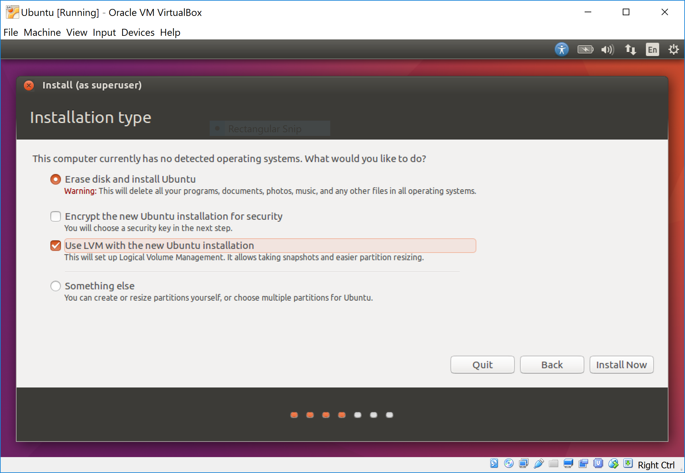

5. Confirm the partition table changes by clicking _continue_.

  

6. _Where are you?_ should have automatically detected and configured your location via the Internet. If this didn't happen stop and check the "up and down" arrows in the task bar (top right corner) to confirm you have internet access through _NAT_ or _Bridged Mode_ via the host. If you don't have any Internet access that's OK just type into the autocomplete the name of your closet capital city e.g. _Brisbane (Queensland, Australia)_ or your timezone e.g. _Lord Howe Time (Australia)_ and then click _continue_.

  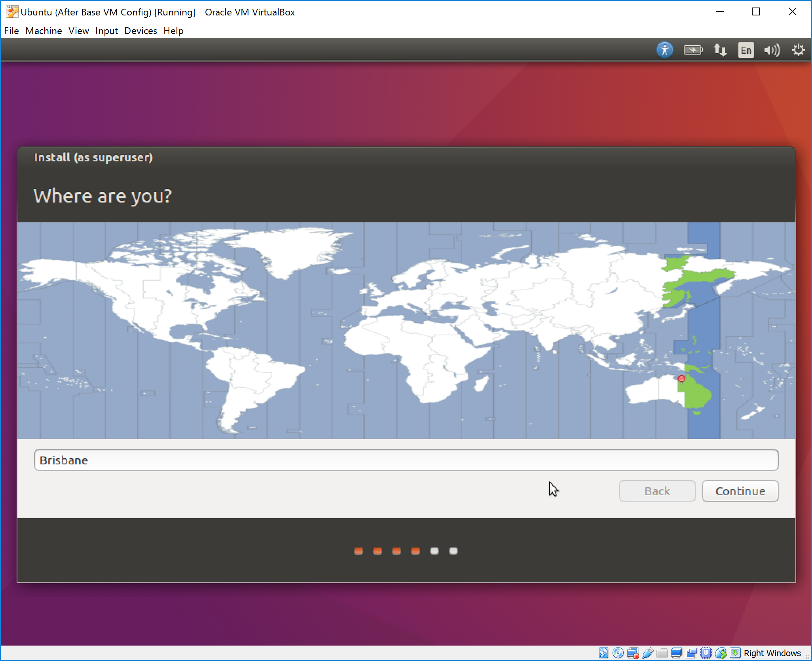

7. Leave the left pane set to __English (US)__. If you're using Windows hardware also leave the right pane set to __English (US)__. If you're using Mac hardware select __English (US) - English (Macintosh)__ in the right pane. Then click on _continue_.

  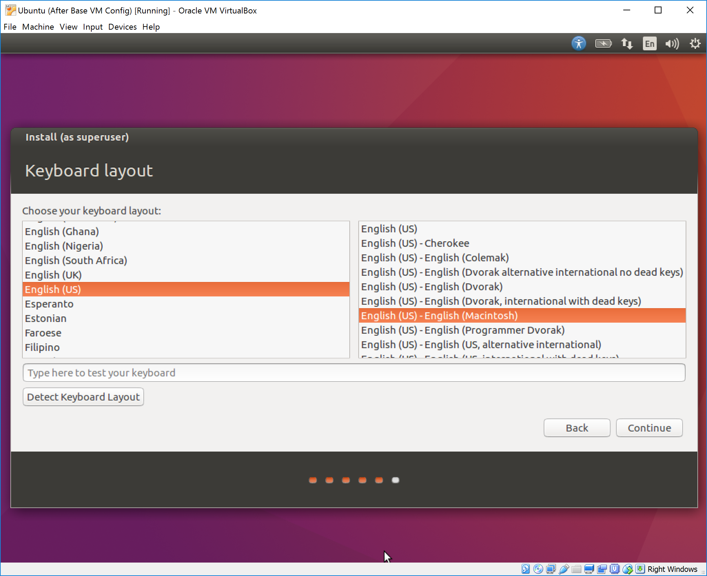

8. _Who are you?_ Use the following guide to fill in these details:

  a. __Your name:__ e.g. Joe William Bloggs

  b. __Your computer's name:__ e.g. megatron

    __Note:__ Feel free to take a look at [RFC1178](https://tools.ietf.org/html/rfc1178) or __TL;DR__ Use all lower case (Unix is case-sensitive). Don't use random combinations of letters and numbers that "encode" some information about the location or function of the computer which are hard to "talk about". At the other end of the spectrum don't use names that will clash or sound like real people's names.

  c. __Pick a username:__ e.g. jwb

    _Note:__ The "Unix way" is to use all your initials for your username. You need to type your username a lot so it's good for it to be short.

  d. __Choose a password__ and __confirm your password__. You will need to remember this password as you'll need it when you want to run things as _root_ (administrator) via `sudo`.

  e. For ease of use (and as this is just a VM) select __log in automatically__.

  f. Click __next__ to begin the process of installing your new Ubuntu Linux system.

  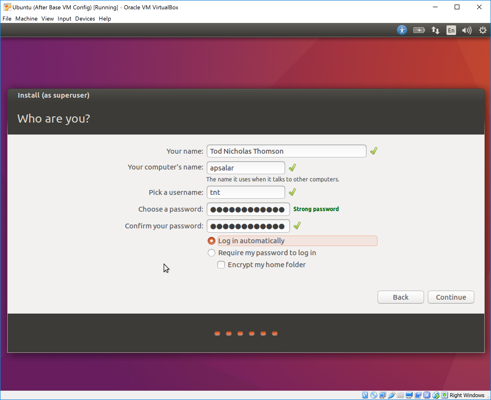

    __Note:__ While you wait, expand the lower section to take a look at the installation _under the hood_. Also _use the left and right arrows_ to explore some user-facing parts of your new Ubuntu install.

9. Once you see the message __installation complete__ click _restart now_.

10. If you see an error with `snd_hda_intel` then select __Machine => Reset => Do not show this message again => Reset__. We will fix this in part 2.

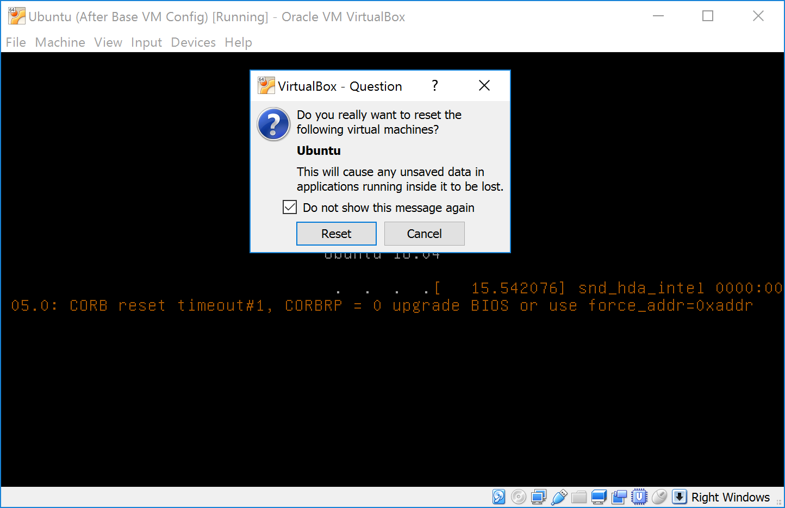

## _All right stop, collaborate and listen!_

Login to your "new shiny" Linux VM and see if you can work out how to play a game of __Beneath a Steel Sky, Freeware CD Version__.

_Beneath a Steel Sky_ is a [SCUMMVM](https://www.scummvm.org) game that is now freely available in the public domain.

The game files `bass-cd-1.2.zip` are available on the USB flash drive (though you may be able to work out how to not need them)... _**hint hint**_ If you're clever you might be able to use `apt-get` to get both SCUMMVM and the game files you need (if you get stuck this will be explained in more detail in Part 2).

You know you have it working when you see the following:

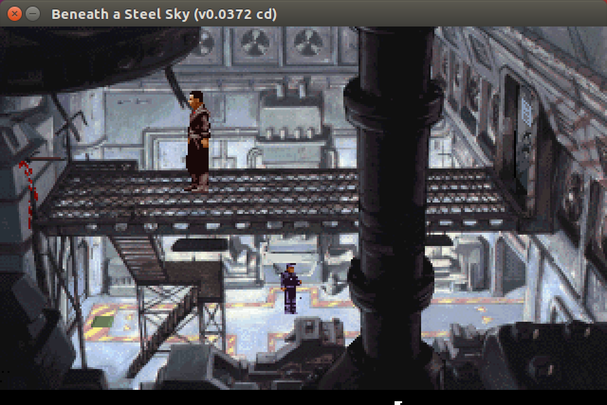

## End of Part 1

__Congrats!__ You now have fresh Ubuntu Linux VM.

Have some morning tea and then head over to [2. Ubuntu Linux Configuration & Maintenance](Part2.md).
