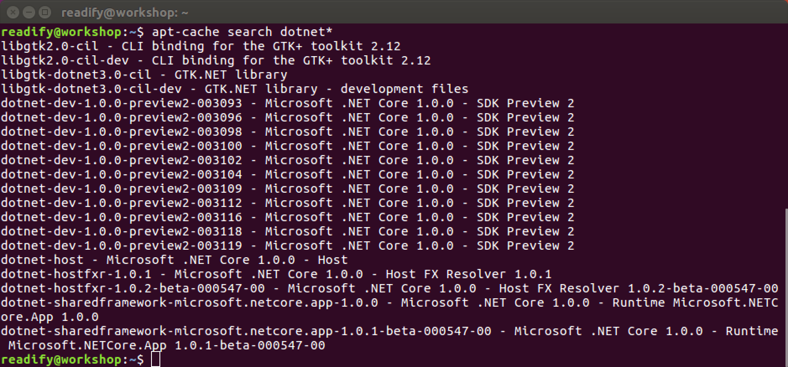
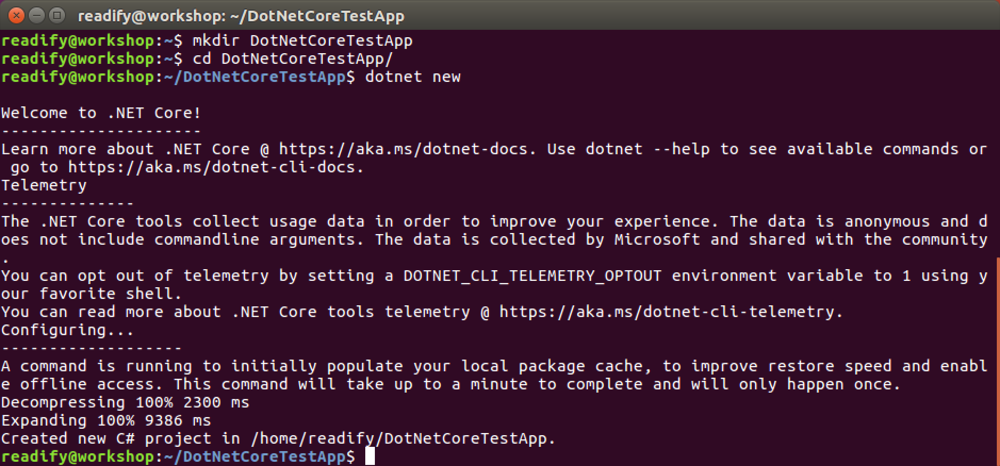

# 3. "Hello, world!" .NET Core


## Supported Distributions

.NET Core is [supported on the following distributions](https://github.com/dotnet/core/blob/master/roadmap.md#technology-roadmaps):

OS                       |Version               |Architectures|
-------------------------|----------------------|-------------|
Red Hat Enterprise Linux | 7.2                  | x64         |
Fedora                   | 23                   | x64         |
Debian                   | 8.2                  | x64         |
Ubuntu                   | 14.04 LTS, 16.04 LTS | x64         |
Linux Mint               | 17                   | x64         |
openSUSE                 | 13.2                 | x64         |
Centos                   | 7.1                  | x64         |
Oracle Linux             | 7.1                  | x64         |
Mac OS X                 | 10.11, 10.12         | x64         |
Windows Client           | 7 SP1 - 10           | x64, x86    |
Windows Server           | 2008 R2 SP1 - 2016   | x64, x86    |

It also __works fine on Ubuntu 16.10 x64__ which is the distribution/version I have used while preparing this workshop.

If you are using one of the distributions above (that is not Ubuntu 16.10 x64) you should go [here](https://www.microsoft.com/net/core) and follow your distribution's specfic instructions, then skip forward a little way to the section entitled _Smoke Testing .NET Core_.

If you are not using one of the above distributions you have two options:

#### 1. Import my pre-baked VirtualBox VM _(The easier method)_

I have pre-prepared an Ubuntu 16.10 x64 VM for you for just this situation. You can now install the latest [VirtualBox 5.1.12](https://www.virtualbox.org/wiki/Downloads) and _VirtualBox Extension Pack 5.1.2_ (available on my USB sticks) and then import the pre-baked vm `LCA2017_Before.ova` now and then continue on with the workshop, or...

#### 2. Compile from source _(The harder method)_ 

You can [compile from source](https://github.com/dotnet/coreclr#building-the-repository) though your milage may vary. If you get stuck you can always fall back to importing the VM.

## Installing .NET Core on Ubuntu Linux 16.10 x64

__Note:__ In order to avoid excessive rehashing of work that's currently in a state of flux I will be providing _fast_ instructions on how to install .NET Core on Ubuntu Linux 16.10 x64.

For more information see [here](https://www.microsoft.com/net/core#ubuntu). The following is practically verbatim from that source.

#### Are we up to date?

First let's check we're completely up to date.

```
sudo apt-get update && sudo apt-get upgrade
```

__Note:__ If you see any errors here please resolve them before continuing.

#### Adding the .NET Core APT feed

Now we're up to date let's add the .NET Core APT feed.

```
sudo sh -c 'echo "deb [arch=amd64] https://apt-mo.trafficmanager.net/repos/dotnet-release/ yakkety main" > /etc/apt/sources.list.d/dotnetdev.list'
```

```
sudo apt-key adv --keyserver apt-mo.trafficmanager.net --recv-keys 417A0893
```

```
sudo apt-get update
```


#### Checking Available .NET Core Versions

Next let's see what .NET Core versions are now available.

```
apt-cache search dotnet*
```



#### Installing the .NET Core SDK

Now we can install the _newest_ version of .NET Core SDK.

```
sudo apt-get install dotnet-dev-1.0.0-preview2.1-003177
```


You can find out more information on versions of the .NET CLI [here](https://github.com/dotnet/cli).

#### Smoke Testing .NET Core

Let's check the version of `dotnet` we now have available.

```
dotnet --version
```


Excellent! We now have version `1.0.0-preview2.1-003177` of the .NET Core SDK.

#### Creating a .NET Core Project

Let's create a new .NET Core Project using the `new` project scaffolding command.

```
mkdir DotNetCoreTestApp
```

```
cd DotNetCoreTestApp
```

```
dotnet new
```



#### Executing NuGet Package Restore

To run our new `DotNetCoreTestApp` we'll need to restore our NuGet packages first.

```
dotnet restore
```


#### Executing the Application

All that is left now is to execute our new .NET Core Application.

```
dotnet run
```


#### Smoke & Mirrors...

Let's confirm it's not all _"an illusion Michael"_.

```
cat Program.cs
```


Superb! The world of .NET Core on Ubuntu Linux is now open to you...

## _All right stop, collaborate and listen!_

Explore .NET Core and/or build a new .NET Core application.

The [.NET Core Concepts](https://dotnet.github.io/docs/core-concepts/index.html) may be useful to you...

## End of Part 3

__Excellent!__ You have said hello to the world of _.NET Core_.

It's time to break for lunch before continuing with [4. "Hello, world!" ASP.NET Core](Part4.md).
