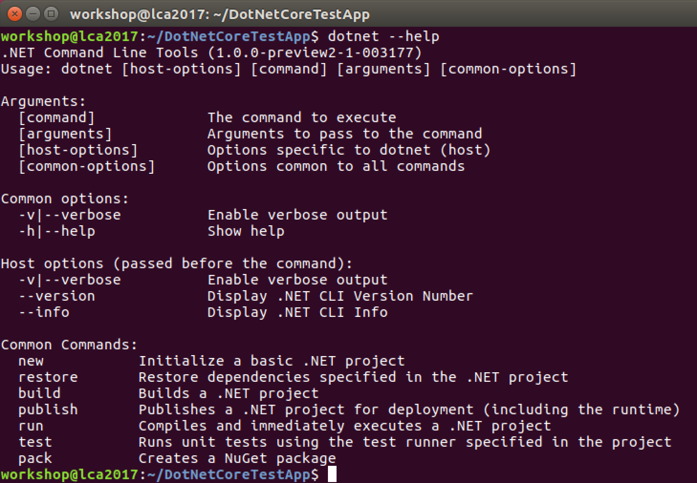
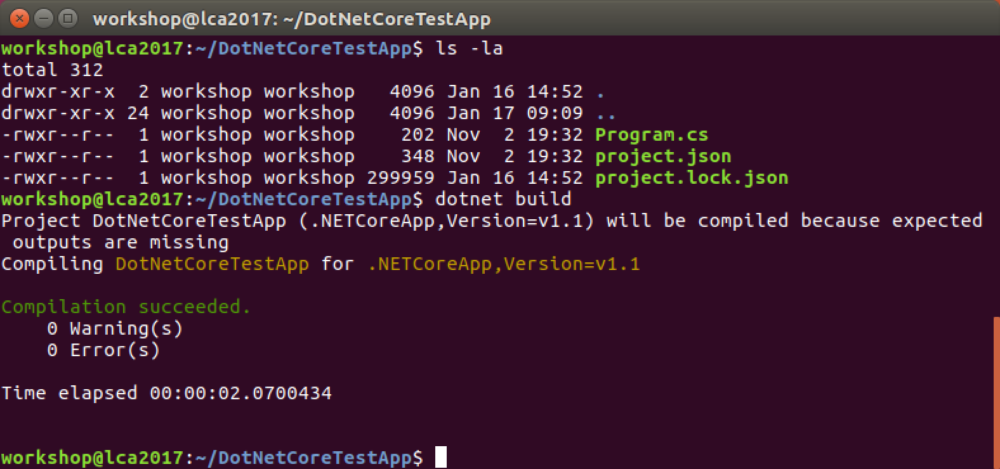
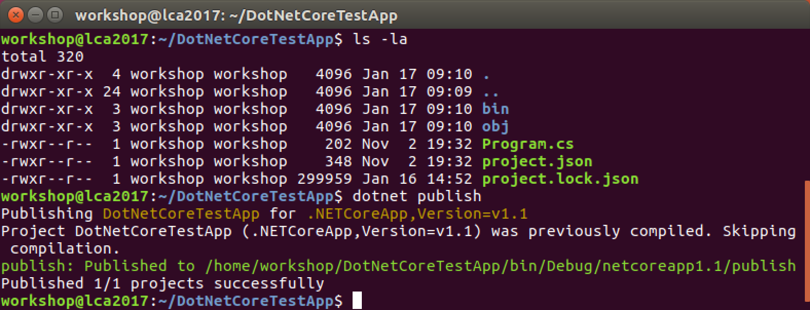
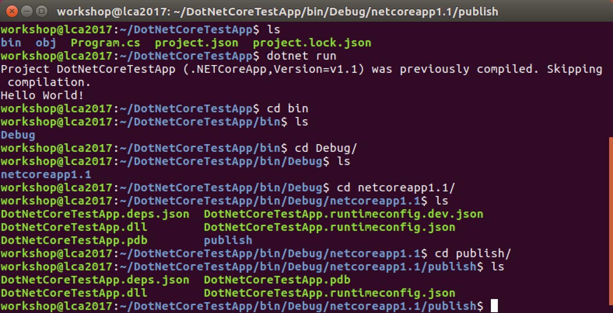
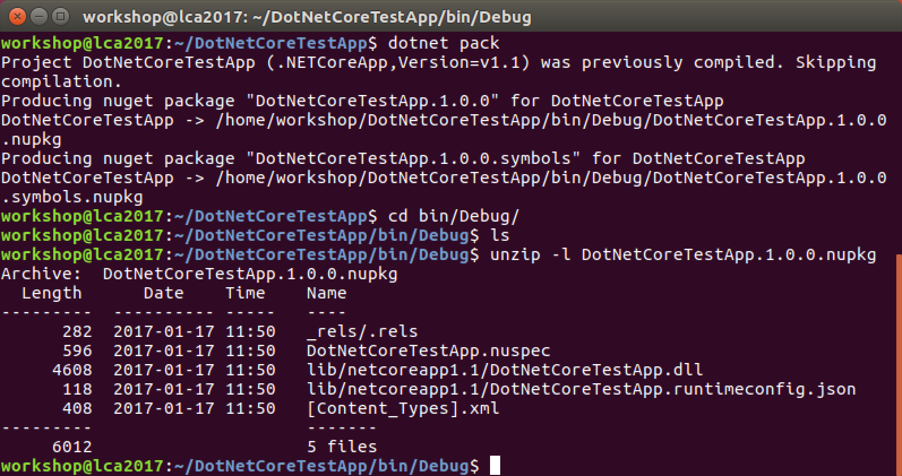
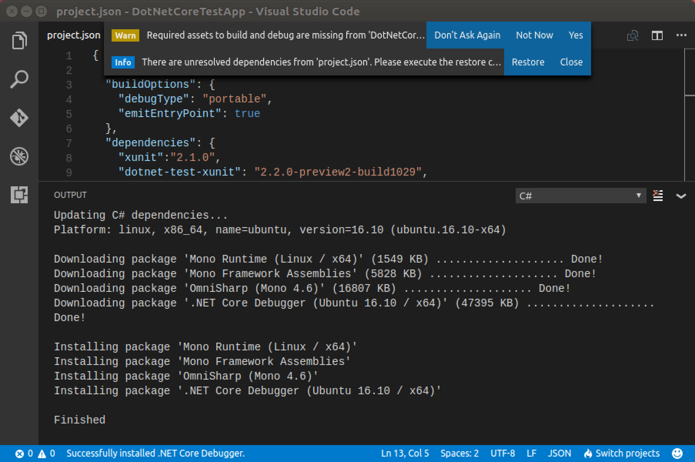
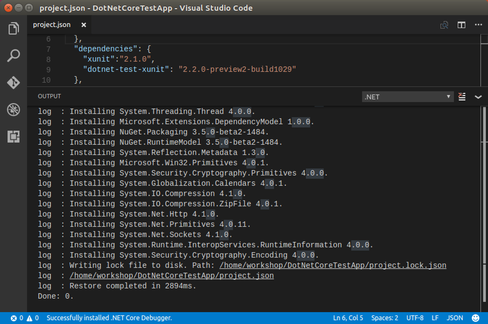

# 3. "Hello, world!" .NET Core

__Note:__ The screenshots may contain out of date version numbers (etc) but the `text commands` should be accurate and up to date i.e. please refer to the text commands and use the screenshots as rough guide to correctness only.


## Supported Distributions

.NET Core is [supported on the following distributions](https://github.com/dotnet/core/blob/master/roadmap.md#technology-roadmaps):

OS                       |Version               |Architectures|
-------------------------|----------------------|-------------|
Red Hat Enterprise Linux | 7.2                  | x64         |
Fedora                   | 23                   | x64         |
Debian                   | 8.2                  | x64         |
Ubuntu                   | 14.04 LTS, 16.04 LTS | x64         |
Linux Mint               | 17                   | x64         |
openSUSE                 | 13.2                 | x64         |
Centos                   | 7.1                  | x64         |
Oracle Linux             | 7.1                  | x64         |
Mac OS X                 | 10.11, 10.12         | x64         |
Windows Client           | 7 SP1 - 10           | x64, x86    |
Windows Server           | 2008 R2 SP1 - 2016   | x64, x86    |

It also __works fine on Ubuntu 16.10 x64__ which is the distribution/version I have used while preparing this workshop.

If you are using one of the distributions above (that is not Ubuntu 16.10 x64) you should go [here](https://www.microsoft.com/net/core) and follow your distribution's specfic instructions, then skip forward a little way to the section entitled _Smoke Testing .NET Core_.

If you are not using one of the above distributions you have two options:

#### 1. Import my pre-baked VirtualBox VM _(The easier method)_

I have pre-prepared an Ubuntu 16.10 x64 VM for you for just this situation.

You can now install the latest [VirtualBox 5.1.12](https://www.virtualbox.org/wiki/Downloads) and _VirtualBox Extension Pack 5.1.2_ (available on my USB sticks) and then import the pre-baked vm `LCA2017_Before.ova` (also available on my USB sticks) now and then continue on with the workshop, or...

__Note:__ Please ask an I will supply the password for the VM.

#### 2. Compile from source _(The harder method)_ 

You can [compile from source](https://github.com/dotnet/coreclr#building-the-repository) though your milage may vary. If you get stuck you can always fall back to importing the VM.

## Installing .NET Core on Ubuntu Linux 16.10 x64

__Note:__ The following are _fast_ instructions on how to install .NET Core on Ubuntu Linux 16.10 x64. For more information see [here](https://www.microsoft.com/net/core#ubuntu).

#### Are we up to date?

First let's check we're completely up to date.

```
sudo apt-get update && sudo apt-get upgrade
```

__Note:__ If you see any errors here please resolve them before continuing.

#### Adding the .NET Core APT feed

Now we're up to date let's add the .NET Core APT feed.

```
sudo sh -c 'echo "deb [arch=amd64] https://apt-mo.trafficmanager.net/repos/dotnet-release/ yakkety main" \
> /etc/apt/sources.list.d/dotnetdev.list'
```

```
sudo apt-key adv --keyserver apt-mo.trafficmanager.net --recv-keys 417A0893
```

```
sudo apt-get update
```


#### Checking Available .NET Core Versions

Next let's see what .NET Core versions are now available.

```
apt-cache search dotnet
```


#### Installing the .NET Core SDK

Now we can install the _newest_ version of .NET Core SDK.

```
sudo apt-get install dotnet-dev-1.0.0-preview2-1-003177
```


You can find out more information on versions of the .NET CLI [here](https://github.com/dotnet/cli).

#### Smoke Testing .NET Core

Let's check the version of `dotnet` we now have available.

```
dotnet --version
```


Excellent! We now have version `1.0.0-preview2-1-003177` of the .NET Core SDK.

#### Creating a .NET Core Project

Let's create a new .NET Core Project using the `new` project scaffolding command.

```
mkdir DotNetCoreTestApp
```

```
cd DotNetCoreTestApp
```

```
dotnet new
```


#### Executing NuGet Package Restore

To run our new `DotNetCoreTestApp` we'll need to restore our NuGet packages first.

```
dotnet restore
```


#### Executing the Application

All that is left now is to execute our new .NET Core Application.

```
dotnet run
```


#### Smoke & Mirrors...

Let's confirm it's not all _"an illusion Michael"_.

```
cat Program.cs
```


Superb! The world of .NET Core on Ubuntu Linux is now open to you...

## Exploring the .NET Core CLI

As you have already seen .NET Core is driven by the [`dotnet` Core CLI](https://github.com/dotnet/cli).

Let's take a look at the features provided by `dotnet`.

```
dotnet --help
```



We have seen `dotnet new`, `dotnet restore` and `dotnet run` already.

#### `dotnet new`

The [`dotnet new`](https://docs.microsoft.com/en-us/dotnet/articles/core/tools/dotnet-new) command scaffolds the simplest .NET Core application possible (the Hello, world!) which is made up of two files: `Program.cs` and `project.json`.

`Program.cs` contains the `public static void Main(string[] args)` that is the entry point for your application. It also writes the `Hello, world!` to the console.

`project.json` is your project's configuration file. It (amongst other things) defines the dependencies of your application. You can see that your application is targetting version `1.1` of the .NET Core platform and runtime via the `netcoreapp1.1` framework dependency.


#### `dotnet restore`

The [`dotnet restore`](https://docs.microsoft.com/en-us/dotnet/articles/core/tools/dotnet-restore) command's job is to restore your dependencies. In the current case this is just `Microsoft.NETCore.App` which is a "meta package" for the [set of .NET API's](https://github.com/dotnet/corefx/) that are included in the default .NET Core application model. As you expand the scope of your application you will add more dependencies in this location.

.NET Core dependencies / packages are restored from [http://www.nuget.org](http://www.nuget.org) by default. You can also opt-in to restore packages from other locations (e.g. internal package sources).


#### `dotnet build`

It seems self-evident that [`dotnet build`](https://docs.microsoft.com/en-us/dotnet/articles/core/tools/dotnet-build) will build (compile, etc) your .NET Core application. You can learn more about the .NET Core build process [here](https://docs.microsoft.com/en-us/dotnet/articles/core/tools/dotnet-build). Take some time to read more about the .NET Core build process now.



#### `dotnet publish`

The [`dotnet publish`](https://docs.microsoft.com/en-us/dotnet/articles/core/tools/dotnet-publish) command copies your application and all its dependencies into a folder preparing it for publishing. Importantly it produces one of the following three types of outputs:

1. _A portable application:_ An application in .NET's Common Intermediate Language (CIL) which allows the application to be executed anywhere there is a compatible .NET Runtime. In our current situation (on GNU/Linux, with .NET Core)this runtime is the [CoreCLR](https://github.com/dotnet/coreclr) (the .NET Core Common Language Runtime) though there are other compatible (legacy perhaps) runtimes that can be used.

2. _A portable application with native dependencies:_ the same as the above with an extra platform folder containing the native dependency(s). This is important as a single application bundle can be delivered to multiple platforms where there are some native dependencies required.

3. _A self-contained application:_ the same as either of the above, but we also bundle the runtime(s) required to execute the application. This is great as the application then contains everything required for execution on all target platforms, rather than an expectation/supposition that the target operating system will have the precise version of the runtime required for our application. This is a relatively new concept for .NET.

__Note:__ All of the above application types still require the `dotnet run` command to bootstrap their execution.



#### `dotnet run`

Unsurprisingly the [`dotnet run`] command(https://docs.microsoft.com/en-us/dotnet/articles/core/tools/dotnet-run) will execute your application. But it actually does more than that. It allows you to have a single command to prepare and execute your application. It will detect if you do not have an up-to-date build of your application and then execute `dotnet build`. It will also detect if you have missing dependencies and execute `dotnet restore` etc.

Take some time to [read more](https://docs.microsoft.com/en-us/dotnet/articles/core/tools/dotnet-run) about `dotnet build` now.

__Note:__ In the future .NET Core will support "native compilation" (they call this .NET Native which is an ahead-of-time compiler) where a native binary can be produced per-target-platform. This process is [currently under active development](https://github.com/dotnet/corert). My understanding is that this will produce an [ELF](https://en.wikipedia.org/wiki/Executable_and_Linkable_Format) binary.



#### `dotnet test`

The [`dotnet test`] command(https://docs.microsoft.com/en-us/dotnet/articles/core/tools/dotnet-test) runs your unit tests using the configured test runner. We will learn more about unit testing in the next section.


#### `dotnet pack`

The [`dotnet pack`](https://docs.microsoft.com/en-us/dotnet/articles/core/tools/dotnet-pack) command packages your application as a [NuGet Package](https://www.nuget.org). The NuGet Package is the package format for .NET applications, libraries, frameworks, etc. Like many other packaging formats it's basically just a zip file and a manifest file with a `.nupkg` extension.

The NuGet Package will become relevent once you want to distribute your application, library, framework, etc.



That's it for `dotnet` CLI commands.

## Unit Testing in .NET Core (and optional Visual Studio Code)

__Prerequisite:__ If you would like to check out _Visual Studio Code_ (VS Code) please go [here](https://code.visualstudio.com) and install it for your operating system / distribution of choice. It's also 100% OK to continue on with your text editor of choice.

Open VS Code (or another text editor of your choice) and edit `project.json` updating the `"dependencies": {}` section so it looks like the following:

```
  "dependencies": {
    "xunit":"2.1.0",
    "dotnet-test-xunit": "2.2.0-preview2-build1029"
  },
```

__Note:__ If you chose to try out VS Code you may be prompted to install the C# Language Extension. If so go ahead and click on "show recommendations" to do that now.


If you're using VS Code you will see the following prompts after restarting the editor. Go ahead and select "yes" to install the required assets for building and debugging via VS Code.



Next you can select "restore" in VS Code or run `dotnet restore` from the command line to restore (download) your new `dependencies`. You should then see output similar to the following.



TODO: Continue from here writing the unit test...

## _All right stop, collaborate and listen!_

Explore .NET Core and/or build a new .NET Core application.

The [.NET Core Concepts](https://dotnet.github.io/docs/core-concepts/index.html) may be useful to you...

## End of Part 3

__Excellent!__ You have said hello to the world of _.NET Core_.

It's time to break for lunch before continuing with [4. "Hello, world!" ASP.NET Core](Part4.md).
