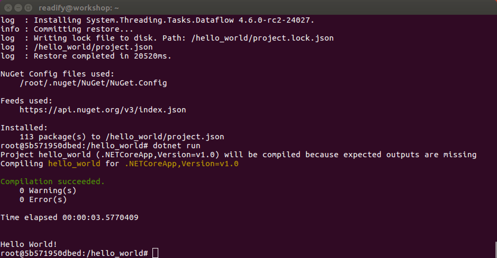

# 5. "Hello, world!" Docker

_**Note:** Apologies I ran out of time to screenshot and customise this section for the workshop..._

#### What is LXC (Linux Containers)?

> [LXC](https://en.wikipedia.org/wiki/LXC) ([Linux Containers](https://linuxcontainers.org/)) is an operating-system-level virtualization method for running multiple isolated Linux systems (containers) on a control host using a single Linux kernel.

#### What is Docker

> [Docker](https://en.wikipedia.org/wiki/Docker_(software)) is an open-source project that automates the deployment of applications inside software containers, by providing an additional layer of abstraction and automation of operating-system-level virtualization on Linux.

## Installing Docker 1.12 RC on Ubuntu Xenial 16.04 (LTS)

Follow the Ubuntu Xenial 16.04 (LTS) instructions [__here__](https://docs.docker.com/engine/installation/linux/ubuntulinux/) to install the Docker Engine 1.12 RC.

Keep going until you get to `sudo docker run hello-world` and you will see the following.

#### Optional Docker Configuration

Now continue on and complete the following  _optional configurations_ as they will make running Docker lower friction and more enjoyable for you.

1. [Create a docker group](https://docs.docker.com/engine/installation/linux/ubuntulinux/#create-a-docker-group) so you don't have to run Docker with `sudo`.

2. [Adjust memory and swap accounting](https://docs.docker.com/engine/installation/linux/ubuntulinux/#adjust-memory-and-swap-accounting) primarily to avoid getting spammed with warnings.

3. [Configure Docker to start on boot](https://docs.docker.com/engine/installation/linux/ubuntulinux/#configure-docker-to-start-on-boot) so you don't have to remember to start it every time.

## .NET Core RC2 "Hello, world!" on Docker 1.12 RC

Follow the instructions [__here__](https://www.microsoft.com/net/core#docker) to test drive .NET Core RC2 on Docker Engine 1.12 RC.

Keep going until you get to `dotnet run` and you will see the following.

__Superb!__ You now have your "Hello, world!" on both vanilla Docker and .NET Core on Docker.

## _All right stop, collaborate and listen!_

Bring your application from parts 3 and 4 over to Docker. The idea is that you will [compose](https://docs.docker.com/compose/) your .NET Core and ASP.NET Core applications from separate Docker containers into an integrated application-whole and get them communicating to each other over the [network](https://docs.docker.com/engine/userguide/networking/) i.e. this is the beginning of your journey into [Docker-hosted Microservices](https://dotnet.github.io/docs/tutorials/getting-started-with-csharp/microservices.html).

## End of Part 5

__Congratulations!__ You have completed the workshop.

## Next => Choose your own adventure...

1. Use the [Ubuntu Apps Directory](https://apps.ubuntu.com/cat/) to "re-build" your desktop (with all the apps you love) in Ubuntu.

2. Continuing building-out and adding-to your [Microservices](http://martinfowler.com/articles/microservices.html) application.

3. Ignore Docker completely and build a [Majestic Monolith](https://m.signalvnoise.com/the-majestic-monolith-29166d022228) on .NET Core.

4. Have an existing .NET application? [Here's a guide on porting to .NET Core](https://blogs.msdn.microsoft.com/dotnet/2016/02/10/porting-to-net-core/).

5. Know a good FOSS .NET framework or library that isn't yet available on .NET Core? Mark Rendle says [port it to .NET Core](https://blog.rendle.io/net-core-a-call-to-action/). Go go go!

6. Looking for something new? Interested in JavaScript? Try out my "work in progress" __Part 6__ [.NET Core "Hello, world!" via Node.js & Yeoman](Part6.md).

Or just do whatever takes your fancy, but remember...

__Production or it didn't happen!__

I encourage you to share what you have built under an [OSI-approved license](https://opensource.org/licenses) on [GitHub](https://github.com/).
